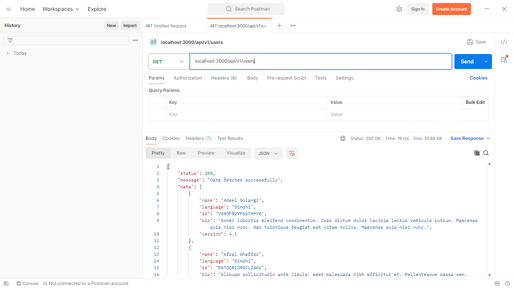
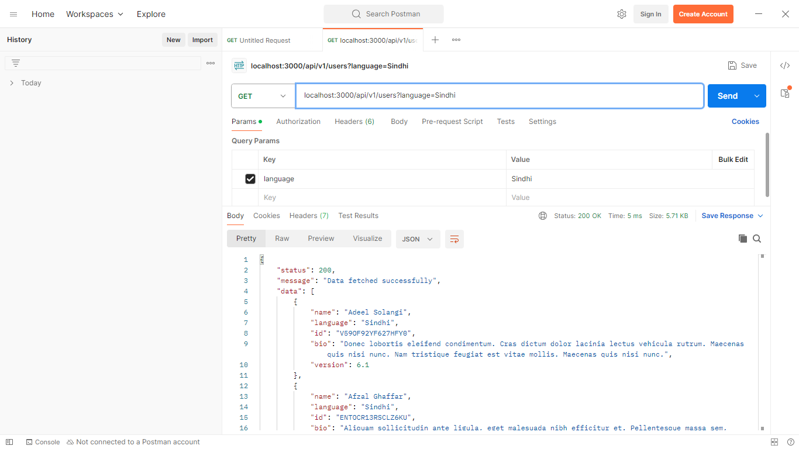
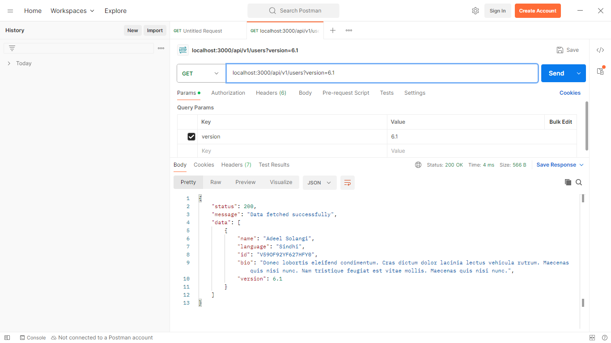
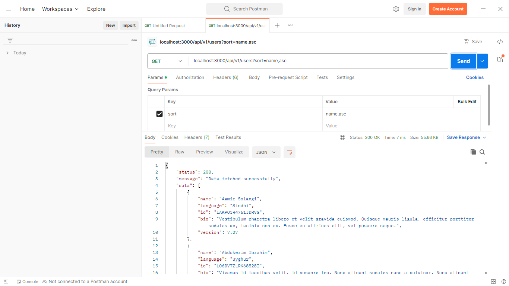
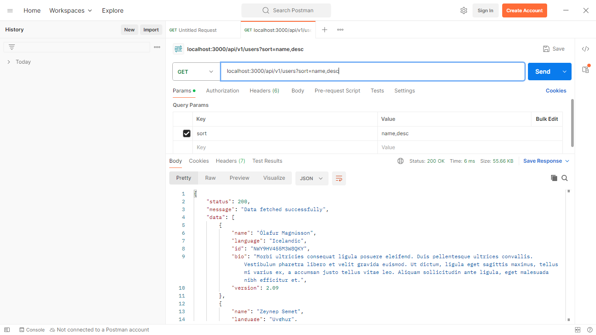

# Rocketium Node Project

## Description

This project is a Node.js application that provides an API for fetching and managing dummy user data. The API supports filtering and sorting operations and is built using Express.js.

## Live Demo

[Live Working Project](https://rocketium-node-app.onrender.com/api/v1/users)
<br/>
PS: The server takes 2-3 min to start for the first request.

## Getting Started

### Prerequisites

- **Node.js** (>= 20.x)
- **npm** (Node Package Manager)

### Installation

1. **Clone the Repository:**
    ```bash
    git clone https://github.com/HackerXeroid/rocketium-node-app
    ```

2. **Navigate to the Project Directory:**
    ```bash
    cd rocketium-node-app
    ```

3. **Install Dependencies:**
    ```bash
    npm install
    ```

4. **Start the Server:**
    ```bash
    npm start
    ```
    The server will start and listen on the port specified in the `.env` file (default is `3000`).

### Usage

#### API Endpoints

- **GET** `/api/v1/users`
  - Retrieves the list of all users.
  - **Query Parameters:**
    - `name` (string) - Filter users by name.
    - `language` (string) - Filter users by programming language.
    - `version` (integer) - Filter users by version.
    - `sort` (string) - Sort results. Example: `name,asc` or `language,desc`.

#### Example Requests

1. **Get All Users:**
    ```http
    GET /api/v1/users
    ```

2. **Filter by Name:**
    ```http
    GET /api/v1/users?name=John
    ```

3. **Filter by Language and Version:**
    ```http
    GET /api/v1/users?language=JavaScript&version=2
    ```

4. **Sort by Name in Descending Order:**
    ```http
    GET /api/v1/users?sort=name,desc
    ```

### Postman Documentation

To interact with the API using Postman, you can import the provided Postman collection. Below are snapshots demonstrating various API requests and their responses.

1. **Import Postman Collection:**
   - Download the Postman collection file from [Postman Collection](./docs/postman/postman-collection.json).
   - Open Postman and go to "File" > "Import" and select the downloaded file.

2. **API Request Examples:**

   - **Get All Users**
     
     *Description: Snapshot showing the request and response for fetching all users.*

   - **Filter by Name**
     
     *Description: Snapshot showing the request and response for filtering users by name.*

   - **Filter by Language**
     
     *Description: Snapshot showing the request and response for filtering users by language.*

   - **Filter by Version**
     
     *Description: Snapshot showing the request and response for filtering users by version.*
  
   - **Sort by Name in Ascending Order**
     
     *Description: Snapshot showing the request and response for sorting users by name in ascending order.*

   - **Sort by Name in Descending Order**
     
     *Description: Snapshot showing the request and response for sorting users by name in descending order.*

### Contributing

If you'd like to contribute to the project, please follow these steps:

1. Fork the repository.
2. Create a new branch (`git checkout -b main`).
3. Commit your changes (`git commit -m 'Add new feature'`).
4. Push to the branch (`git push origin main`).
5. Create a new Pull Request.

### License

This project is licensed under the MIT License - see the [LICENSE](https://opensource.org/license/mit) file for details.

## Contact

For any questions or feedback, please reach out to **Shivam Singh** at [xeroid.space@gmail.com](mailto:xeroid.space@gmail.com).

---

### Notes on `package.json`

- **`"start"` Script:**
  The `start` script uses `node --watch server.js` to automatically restart the server on code changes during development.

- **Dependencies:**
  - `axios`: For making HTTP requests.
  - `dotenv`: For managing environment variables.
  - `express`: For building the web server and API.

- **Node.js Compatibility:**
  The project is compatible with Node.js version 20.x.